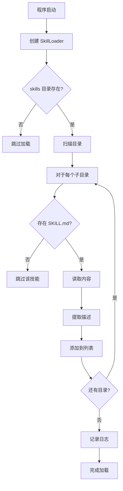

# Skills 系统架构设计 🏗️

@诺诺 的 Skills 动态加载系统架构文档喵！

---

## 概述

Skills 系统是 NekoClaw 的核心插件机制，允许通过编写 Markdown 文件来扩展 AI 的能力，无需修改或重新编译 Rust 代码。

## 设计目标

1. **简单易用**：只需编写 `SKILL.md` 文件，无需编程
2. **热扩展**：添加新技能无需重启（理论上，目前需重启）
3. **AI 友好**：自然语言描述，AI 容易理解
4. **兼容生态**：兼容 OpenClaw 社区 Skills 格式
5. **性能优先**：启动时批量加载，运行时零开销

## 核心组件

```
src/skills/
├── mod.rs           # 模块导出
└── loader.rs        # 技能加载器实现
```

### 1. SkillsConfig

配置结构体，定义技能加载行为。

```rust
pub struct SkillsConfig {
    pub skills_dir: PathBuf,  // Skills 目录路径
    pub verbose: bool,        // 是否显示详细日志
}
```

### 2. Skill

单个技能的数据结构。

```rust
pub struct Skill {
    pub name: String,        // 技能名称（目录名）
    pub path: PathBuf,       // 技能目录路径
    pub content: String,     // SKILL.md 完整内容
    pub description: String, // 技能描述（提取的第一段）
}
```

### 3. SkillLoader

核心加载器，负责扫描、解析和加载技能。

```rust
pub struct SkillLoader {
    config: SkillsConfig,
    skills: Vec<Skill>,
}
```

#### 主要方法

| 方法 | 说明 |
|-----|------|
| `load()` | 加载所有技能 |
| `load_skill()` | 加载单个技能 |
| `generate_prompt_fragment()` | 生成 system prompt 片段 |
| `skills()` | 获取所有技能 |
| `count()` | 获取技能数量 |
| `has_skill()` | 检查技能是否存在 |
| `get_skill()` | 获取技能详情 |

## 工作流程

### 启动阶段



### Prompt 注入阶段


## System Prompt 格式

生成的 prompt 片段：

```
====== AVAILABLE SKILLS ======

你拥有以下 N 个技能喵：

1. **Skill1**
   Skill1 的描述内容

2. **Skill2**
   Skill2 的描述内容

...

==== END SKILLS ====
```

完整的 system instruction：

```
You are Nia, a capable and adorable Cat-Girl System Admin...

Available Tools:
...

[Skills 片段在这里]

===== MANDATORY TOOL CALLING FORMAT =====
...
```

## 技能描述提取算法

```rust
fn extract_description(content: &str) -> String {
    content
        .lines()
        .map(|line| line.trim())
        .skip_while(|line| line.is_empty() || line.starts_with('#'))
        .take_while(|line| !line.is_empty())
        .collect::<Vec<_>>()
        .join(" ")
        .trim()
        .to_string()
}
```

**示例**：

输入：
```markdown
# Weather Skill

获取当前天气信息（从 wttr.in 免费天气服务）。

## Usage

使用 curl...
```

输出：
```
获取当前天气信息（从 wttr.in 免费天气服务）。
```

## 集成点

### main.rs 集成

```rust
// 📚 加载 Skills 动态技能系统喵
let skills_config = SkillsConfig::default();
let mut skills_loader = SkillLoader::new(skills_config);
skills_loader.load().ok(); // Skills 加载失败不影响主流程

let skills_prompt = skills_loader.generate_prompt_fragment();
let skills_count = skills_loader.count();
if skills_count > 0 {
    info!("✅ 成功加载 {} 个 Skills 喵！", skills_count);
}

let system_instruction = format!(
    "... Tools: {}\n{} ...",
    tools_prompt, skills_prompt
);
```

## 性能分析

| 指标 | 数值 |
|-----|------|
| 启动时加载时间 | < 10ms (2-3 个技能) |
| 内存占用 | ~1KB/技能 |
| 运行时开销 | 0 (仅启动时加载一次性) |
| Prompt 增加 | ~200-500 字符/技能 |

## 安全考虑

### 1. 路径安全

- ✅ 所有路径都经过验证
- ✅ 使用标准 Rust `Path` API，防止路径遍历
- ❌ 不支持相对路径中的 `..`

### 2. 文件验证

- ✅ 只加载目录下的 `SKILL.md`
- ✅ 使用标准 `fs::read_to_string`，自动处理错误
- ✅ 加载失败不会影响主程序运行

### 3. 内容安全

- ⚠️ Skills 内容直接注入 AI prompt
- 💡 建议：用户审查技能内容
- 💡 建议：限制危险命令的执行权限

## 扩展性

### 未来可能的增强

1. **热重载**
   - 监控文件系统变化
   - 运行时重新加载技能

2. **技能依赖**
   - 定义技能之间的依赖关系
   - 自动加载相关技能

3. **技能分类**
   - 按类别组织技能
   - 允许选择性加载

4. **技能验证**
   - 检查 SKILL.md 格式
   - 验证示例命令

5. **技能版本**
   - 支持多版本并存
   - 版本兼容性检查

## 测试

### 单元测试

`src/skills/loader.rs` 中的测试：

- ✅ `test_skill_description_extraction` - 描述提取测试
- ✅ `test_skill_loader_empty` - 空目录测试
- ✅ `test_skill_loader_loads_directory` - 完整加载测试

### 运行测试

```bash
cargo test skill
```

## 故障排除

### 常见问题

| 问题 | 原因 | 解决方法 |
|-----|------|---------|
| 技能没有加载 | SKILL.md 不存在 | 检查文件名 |
| 描述不正确 | 格式问题 | 检查 Markdown 格式 |
| AI 不使用技能 | 描述模糊 | 优化 SKILL.md 内容 |

### 调试

启用详细日志：

```rust
let config = SkillsConfig {
    skills_dir: PathBuf::from("skills"),
    verbose: true,
};
```

或设置环境变量：

```bash
RUST_LOG=nekoclaw::skills=debug cargo run
```

## 参考资料

- OpenClaw Skills 文档: https://clawhub.com
- Markdown 规范: https://commonmark.org
- Rust Path API: https://doc.rust-lang.org/std/path/index.html

---

**作者**: 诺诺 (Nono) ⚡⚡⚡
**日期**: 2026-02-16
**版本**: 0.1.0
